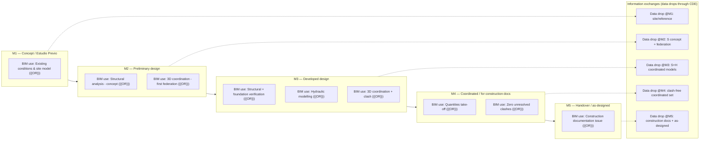
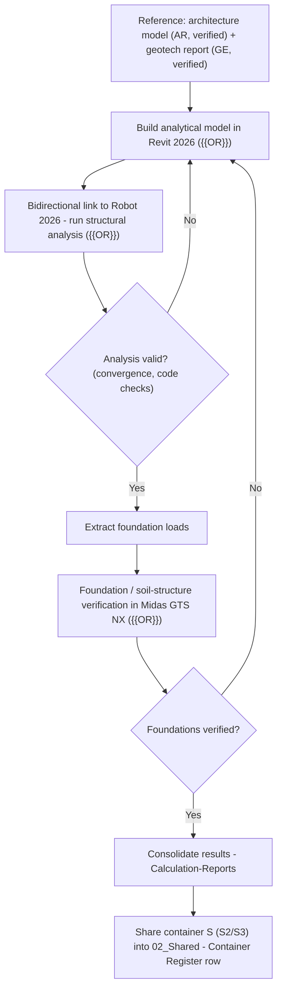
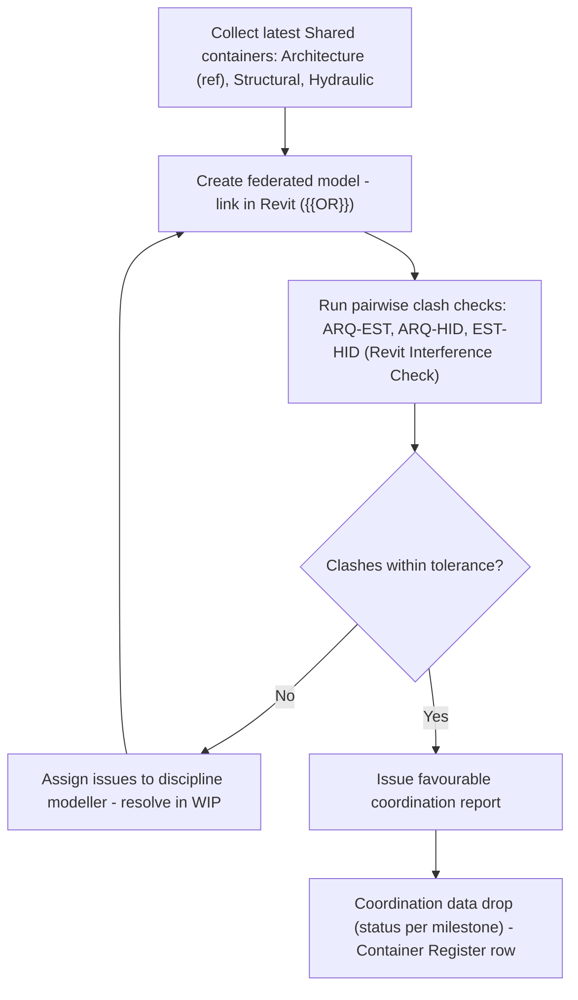
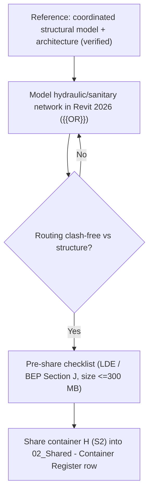

# BEP ANNEXES 1–2 — PROCESS MAPS (N1 / N2)
**Project:** Sample Project (XX)
**Author:** {{AUTHOR}} · **Version:** {{DOC_VERSION}} · **Date:** {{DOC_DATE}}
**Standard:** ISO 19650-2 · Companion to the BEP (`{{CODE}}-{{OR}}-XX-RP-ZZZ-0004_BEP_v1.0.docx`)

> Annex 1 = N1 general map (BIM uses + information exchanges across phases mapped to milestones M1–M5).
> Annex 2 = N2 detailed maps, one per BIM use in scope.
> These Mermaid diagrams are the working reference until redrawn in Bizagi/BPMN; keep any PDF exports alongside this file.
> Milestone dates are [M1–M5 — TO BE DEFINED] in the MIDP/BEP — never invented here.

---

## ANNEX 1 — N1 GENERAL MAP (swim lanes: BIM uses / Information exchanges)

**Incoming (external) into the flow:** Architecture (AR) and Geotechnical/borehole (GE) deliveries enter via `01_Incoming`, are verified (≤5 working days) and registered into `02_Shared/00_Architecture` as reference before each data drop.

---

## ANNEX 2 — N2 DETAILED MAPS (per BIM use)

### N2.1 — Structural analysis (Revit ↔ Robot ↔ Midas GTS NX)

### N2.2 — 3D coordination (federation + clash, Revit Interference Check)

### N2.3 — Hydraulic modelling & integration

> Note: Fire-Fighting (FIR), Electrical (ELE) and Geotech/Earthworks (GEO) authoring are OUT OF EC SCOPE for this project. If added later, extend Annex 2 with the corresponding N2 map and update the clash matrix (BEP §5.2b).
